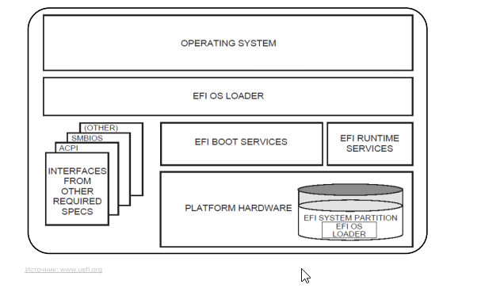
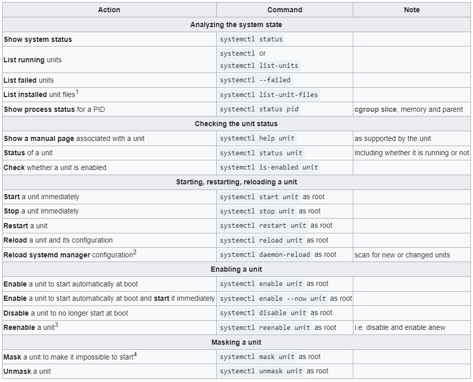
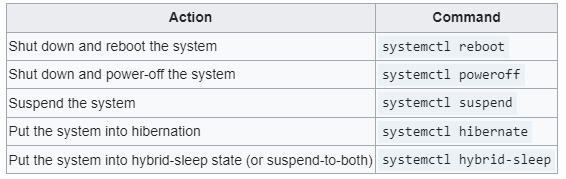

  
# UEFI
Unified Extensible Firmware Interface (UEFI) Specification describes an interface between the operating system (OS) and the platform firmware.  
  

# Boot stages
`SEC – Security Phase`  
This is the first stage of the UEFI boot but may have platform specific binary code that precedes it.  
`PEI – Pre-EFI Initialization`  
The second stage of UEFI boot consists of a dependency-aware dispatcher that loads and runs PEI modules (PEIMs) to handle early hardware initialization tasks such as main memory initialization and firmware recovery operations.  
`DXE – Driver Execution Environment`  
This stage consist of C modules and a dependency-aware dispatcher. With main memory now available, CPU, chipset, mainboard and boot devices are initialized in DXE and BDS.  
`BDS – Boot Device Select`  
BDS is a part of the DXE. In this stage, boot devices are initialized, UEFI drivers or Option ROMs of PCI devices are executed according to system configuration, and boot options are processed.  
`TSL – Transient System Load`  
This is the stage between boot device selection and hand-off to the OS. At this point one may enter UEFI shell, or execute an UEFI application such as the OS boot loader.  
`RT – Runtime`  
The UEFI hands off to the operating system (OS) after ExitBootServices() is executed. (GRUB)  

# GRUB
[GRUB documentation](https://wiki.archlinux.org/title/GRUB)  
[Grub2/Setup](https://help.ubuntu.com/community/Grub2/Setup)  
`GRUB (GRand Unified Bootloader)` is a boot loader. The current GRUB is also referred to as GRUB 2. The original GRUB, or GRUB Legacy, corresponds to versions 0.9x.  
`GRUB 2` builds its menu (grub.cfg) by running scripts found in the `/etc/grub.d/folder` and the settings in the `/etc/default/grub` file.  
Manage `grub.cfg`:  
- /boot/grub/ - Debian, Ubuntu  
- /boot/grub2/ - Red Hat, CentOS  

Create:  
- update-grub/grub2-mkconfig
- /etc/default/grub  

Edit:  
```
sudo nano /etc/default/grub
sudo update-grub
shutdown -r now
```  

# Init  ([documentation](https://wiki.archlinux.org/title/Init))
`init` - Upstart process management daemon.  
`init`  is  the  parent  of all processes on the system, it is executed by the kernel and is responsible for starting all other processes  

Files:  
```
/etc/init.conf
/etc/init/
$HOME/.init/
$XDG_CONFIG_DIRS/upstart/
$XDG_CONFIG_HOME/upstart/
```
# Systemd ([documentation](https://wiki.archlinux.org/title/Systemd))  
`Systemd` is a suite of basic building blocks for a Linux system. It provides a system and service manager that runs as PID 1 and starts the rest of the system. systemd provides aggressive parallelization capabilities, uses socket and D-Bus activation for starting services, offers on-demand starting of daemons, keeps track of processes using Linux control groups, maintains mount and automount points, and implements an elaborate transactional dependency-based service control logic.  

### Using units
  

`/usr/lib/systemd/system/` - units provided by installed packages    
`/run/systemd/system/` - OS system units  
`/etc/systemd/system` - units installed by the system administrator  
`systemd-analyze` — Analyze and debug system manager  

`journalctl` - Query the systemd journal  
  
Example:  
```
journalctl -k -b -1
journalctl -f -u apache
journalctl -u=sshd
journalctl -b 0 -u ssh
journalctl -n 100 /usr/sbin/sshd
journalctl --since=yesterday --until=now
```
Configuring:  
`nano /etc/systemd/journald.conf`  

### Systemd power management 
  

Some (not exhaustive) components of systemd are:  

`kernel-install` — a script used to automatically move kernels and their respective initramfs images to the boot partition;  
`systemd-boot` — simple UEFI boot manager;  
`systemd-cryptenroll` — Enroll PKCS#11, FIDO2, TPM2 token/devices to LUKS2 encrypted volumes;  
`systemd-firstboot` — basic system setting initialization before first boot;  
`systemd-homed` — portable human-user accounts;  
`systemd-logind` — session management;  
`systemd-networkd` — network configuration management;  
`systemd-nspawn` — light-weight namespace container;  
`systemd-resolved` — network name resolution;  
`systemd-stub` — a UEFI boot stub used for creating unified kernel images;  
`systemd-sysusers` — creates system users and groups and adds users to groups at package installation or boot time;  
`systemd-timesyncd` — system time synchronization across the network;  
`systemd/Journal` — system logging;  
`systemd/Timers` — monotonic or realtime timers for controlling .service files or events, reasonable alternative to cron.  

# Processes

`ps` - report a snapshot of the current processes.  
Examples:  
```
ps x - processes only current user
ps ax - all processes
ps u - detailed output

ps -a
ps aux | grep bash
```
PS FIELDS: `PID, TTY, STAT, TIME, COMMAND`  

`top` - display Linux processes
```
top -hv|-bcHiOSs -d secs -n max -u|U user -p pid -o fld -w [cols]
```  
`w` - Show who is logged on and what they are doing.  
`free` - Display amount of free and used memory in the system  
`uptime` - Tell how long the system has been running.  
`atop` - Advanced System & Process Monitor  
```
Interactive Usage:
atop   [-g|-m|-d|-n|-u|-p|-s|-c|-v|-o|-y]   [-C|-M|-D|-N|-A]   [-afFG1xR]   [-L   linelen] [-Plabel[,label]...]  [ interval [ samples ]]

Writing and reading raw logfiles:
atop -w rawfile [-a] [-S] [ interval [ samples ]]
atop  -r  [  rawfile  ]  [-b  hh:mm  ]  [-e  hh:mm  ]   [-g|-m|-d|-n|-u|-p|-s|-c|-v|-o|-y] [-C|-M|-D|-N|-A] [-fFG1xR] [-L linelen] [-Plabel[,label]...]
```
`slabtop` - display kernel slab cache information in real time  
`vmstat` - Report virtual memory statistics  
`htop` - interactive process viewer

# Processes. Event signals
`kill` - send a signal to a process
```
 kill [options] <pid> [...]
```
`skill, snice` - send a signal or report process status
```
skill [signal] [options] expression
snice [new priority] [options] expression
```
 `killall` - kill processes by name  
 ```
killall [-Z, --context pattern] [-e, --exact] [-g, --process-group] [-i, --interactive]
       [-n, --ns PID] [-o, --older-than TIME] [-q, --quiet] [-r, --regexp] [-s, --signal
       SIGNAL, -SIGNAL] [-u, --user user] [-v, --verbose] [-w, --wait] [-y, --younger-than TIME]
       [-I, --ignore-case] [-V, --version] [--] name ...
       killall -l
       killall -V, --version
 ```
 `nice` - run a program with modified scheduling priority  
 `pgrep, pkill` - look up or signal processes based on name and other attributes
```
Find the process ID of the named daemon:
    $ pgrep -u root named
Make syslog reread its configuration file:
    $ pkill -HUP syslogd
Give detailed information on all xterm processes:
    $ ps -fp $(pgrep -d, -x xterm)
Make all chrome processes run nicer:
    $ renice +4 $(pgrep chrome)
```
`renice` - alter priority of running processes
```
renice [-n] priority [-g|-p|-u] identifier...
 ```
`signal` - overview of signals 

The signals SIGKILL and SIGSTOP cannot be caught, blocked, or ignored.

# Links
[Linux Performance Tuning](https://gist.github.com/VitaliySid/e81a06d5158f199859b1b8b34a8d688b)  
[Systemctl documentation](https://www.freedesktop.org/software/systemd/man/systemctl.html)  
[Linux process management](https://iorilan.medium.com/linux-process-management-1-cb4407524705)  
[Signals docs](https://manpages.ubuntu.com/manpages/focal/en/man7/signal.7.html)
 

       

       

       

       

       

       

       

       