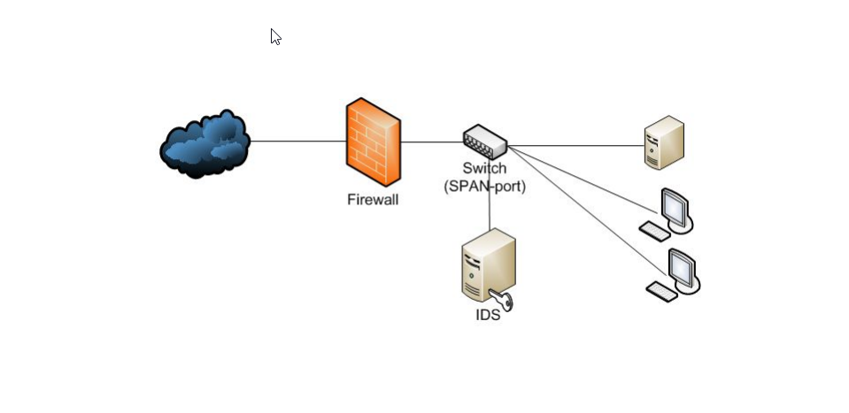
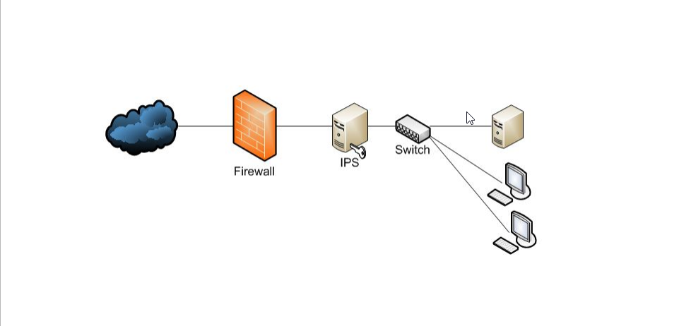

# Monitoring of security events

## Intrusion Detection System

An IDS should be regarded as a diagnostic solution because it tracks and finds behavior throughout a network. If the system discovers an issue, it will notify the security team so they may look into it.  

Types of IDS:  
- Network Intrusion Detection System (NIDS)
- Host Intrusion Detection System (HIDS)
- Protocol-based Intrusion Detection System (PIDS)
- Application Protocol-based Intrusion Detection System (APIDS)
- Hybrid Intrusion Detection System

Detection Method of IDS:
- Signature-based Method
- Anomaly-based Method

## Intrusion Prevention System

In terms of detection, an IPS functions similarly to an IDS system but also has reaction capabilities. When a potential attack, malicious activity, or an unauthorized user is discovered, an IPS solution has more autonomy and takes action.

Types of IPS:
- Network-based Intrusion Prevention System (NIPS)
- Wireless Intrusion Prevention System (WIPS)
- Host-based Intrusion Prevention System (HIPS)
- Network Behavioural Analysis (NBA) (DDoS attacks)

## Suricata
Install Ubuntu:  
```
sudo apt install software-properties-common
sudo add-apt-repository ppa:oisf/suricata-stable
sudo apt update
sudo apt install suricata
sudo suricata-update
sudo systemctl status suricata
```

Settings:  
``` 
sudo nano /etc/suricata/suricata.yaml
sudo systemctl restart suricata
```
For example set EXTERNAL_NET = any  

Logs:  
```
sudo tail /var/log/suricata/suricata.log
sudo tail /var/log/suricata/stats.log
sudo tail -f /var/log/suricata/fast.log
```

Use:  
`sudo suricata -c /etc/suricata/suricata.yaml -i enp0s8`  

Tests:  
```
SYN scan
sudo nmap -sS 192.168.0.3

FIN scan
sudo nmap -sF 192.168.0.3

SYN flood
sudo hping3 -c 100 -d 150 -S -p 80 --flood --rand-source
192.168.0.3

Brute force
hydra -L users.txt -P pass.txt 192.168.0.3 http-get
/index.html  
hydra -L users.txt -P pass.txt 192.168.0.3 ftp
```
## Rules
Format: <font color="red">action </font><font color="green">header </font><font color="blue">options </font>  
Example: <font color="red">drop </font><font color="green">tcp $HOME_NET any -> $EXTERNAL_NET any </font><font color="blue">(msg:”ET TROJAN
Likely Bot Nick in IRC (USA +..)”; flow:established,to_server;
flowbits:isset,is_proto_irc; content:”NICK “; pcre:”/NICK .*USA.*[0-9]{3,}/i”;
reference:url,doc.emergingthreats.net/2008124;
classtype:trojan-activity; sid:2008124; rev:2;)</font>

Actions:
- `alert` (warning)
- `pass` (skip, do not check further)
- `drop` (destroy the package and show a warning)
- `reject/rejectsrc` (send RST/ICMP error to sender)
- `rejectdst` (send RST/ICMP error to recipient)
- `rejectboth` (send RST/ICMP error to sender and recipient)

Protocols:  
```
tcp, udp, icmp, ip

http, ftp, tls, smb, dns, dcerpc, ssh, smtp, imap, modbus, dnp3, enip, nfs, ikev2, krb5, ntp, dhcp, rfb, rdp, snmp, tftp, sip, http2
```
## Traffic direction

`drop tcp $HOME_NET any -> $EXTERNAL_NET any`  
Directions:  
- sender -> recipient  
- sender <> recipient (both directions)

Operators:
- `.../…`      - address range
- `!`          - denial or exclusion
- `[..., ...]` - grouping  

Example: `[$EXTERNAL_NET, !10.1.1.7], ![192.168.0.1, 192.168.0.2]`

## Ports

`drop tcp $HOME_NET any -> $EXTERNAL_NET any`  
Operators:
- `:`      - port range
- `!`          - denial or exclusion
- `[..., ...]` - grouping  
Example: `[80, 8080, 8888], [8000:9000, ![8080, 8100]]`

## Meta Keywords

`msg(message)` — text information about the signature  
`sid(signature ID)` — signature number  
`rev(revision)` — version  
`gid(group ID)` — group number  
`classtype` — used for classification  
`reference` — link (“CVE-2021-2121” cve.mitre.org )  
`priority` — priority (number from 1 to 255)  
`target` — helps to describe the attack  
`metadata` — additional information  

## Example

```
FIN-Scan
alert tcp $EXTERNAL_NET any -> $HOME_NET any (msg:"FIN_SCAN";
flow:stateless; flags:F; classtype:attempted-recon;)

Unencrypted traffic on port 443
alert tcp $EXTERNAL_NET any -> $HOME_NET 443 (msg:"Non-TLS on
TLS port"; flow:to_server; app-layer-protocol:!tls;)

CVE-2020-8271
alert http any any -> any any (msg:"Exploit CVE-2020-8271 on Citrix SD-WAN Center"; flow:to_server,established; content:"POST"; http_method; content:"/://?/collector/licensing/upload"; http_raw_uri; reference:cve,CVE-2020-8271; classtype:web-application-attack; sid:20208271; rev:1;)

```

## Links
[Suricata User Guide](https://suricata.readthedocs.io/en/suricata-6.0.2/)  
[Suricata 6 Rules](https://suricata.readthedocs.io/en/suricata-6.0.0/rules/)  
[Suricata 7(latest) Rules](https://suricata.readthedocs.io/en/latest/rules/index.html)  
